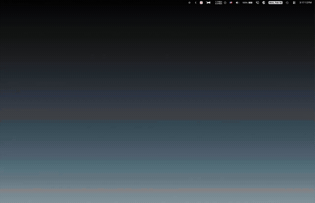

<p align="center">
  
</p>

<h1 align="center">Peek</h1>

<p align="center">A digital privacy screen for macOS.<br>
Blurs your entire screen with a clear circle that follows your mouse cursor.<br>
Keep your content private from wandering eyes while you work.</p>

<p align="center"><strong>Version 1.0</strong> · macOS 13 (Ventura) or later · Apple Silicon & Intel</p>

<p align="center">
  
</p>

## Features

- **Privacy overlay** — blurs or blacks out your screen, with a clear "peek" circle following your mouse
- **Three overlay styles** — Light Blur, Dark Blur, or Blackout
- **Adjustable circle size** — from 100px to 1200px diameter
- **Smooth tracking** — GPU-accelerated mask follows your cursor with zero lag
- **Click-through** — all mouse clicks pass through to apps underneath
- **Multi-monitor support** — covers all connected displays
- **Menu bar app** — no Dock icon, stays out of your way
- **Remembers your preferences** — circle size and overlay style persist between sessions

## Usage

1. Open Peek — an eye icon appears in the menu bar
2. **Left-click** the menu bar icon to toggle the privacy overlay on/off
3. **Right-click** the menu bar icon to access Settings, About, and Quit
4. Move your mouse to reveal content through the peek circle

### Keyboard Shortcuts

| Shortcut | Action |
|----------|--------|
| `Cmd + ,` | Open Settings |
| `Cmd + Q` | Quit Peek |

## Installation

Open the DMG and drag Peek to your Applications folder.

On first launch, macOS will ask for **Accessibility** permission (needed for global mouse tracking). Grant it in **System Settings > Privacy & Security > Accessibility**.

## Building from Source

Requires Swift 5.9+ and macOS 13+.

```sh
# Build the app and create a DMG
./build-app.sh
```

This compiles a release binary, creates `Peek.app`, and packages it into `Peek.dmg`.

## Built With

Swift + AppKit — zero external dependencies
