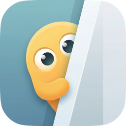
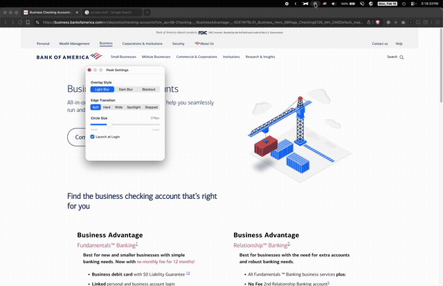

<p align="center">
  
</p>

<h1 align="center">Peek</h1>

<p align="center">A digital privacy screen for macOS that blurs everything except a clear circle around your cursor.<br>
For working in public without turning your screen into a billboard.</p>

<p align="center"><strong>Version 1.1</strong> · macOS 13 (Ventura) or later · Apple Silicon & Intel</p>
<p align="center"><a href="https://github.com/madebysan/peek/releases/latest"><strong>Download Peek</strong></a></p>

<p align="center">
  
</p>

---

Peek is a menu bar app that blurs your whole screen except for a clear circle around your cursor. For coffee shops, trains, anywhere with someone next to you.

## How it works

Three overlay styles: Light Blur, Dark Blur, and Blackout. The clear circle is 100–1200px and follows your cursor with no lag. Clicks pass through to whatever's underneath.

## Usage

1. Open Peek. An eye icon appears in the menu bar.
2. **Left-click** the menu bar icon to toggle the privacy overlay on / off
3. **Right-click** the menu bar icon to access Settings, About, and Quit
4. Move your mouse to reveal content through the peek circle

### Keyboard shortcuts

| Shortcut | Action |
|----------|--------|
| `⌥⌘P` (default) | Toggle privacy overlay |
| `Cmd + ,` | Open Settings |
| `Cmd + Q` | Quit Peek |

Change the toggle shortcut in **Settings**: click the shortcut field and press your preferred key combination.

## Installation

[**Download Peek v1.1**](https://github.com/madebysan/peek/releases/tag/v1.1). Open the DMG and drag Peek to your Applications folder.

On first launch, macOS will ask for **Accessibility** permission (needed for global mouse tracking). Grant it in **System Settings → Privacy & Security → Accessibility**.

## Building from source

Requires Swift 5.9+ and macOS 13+.

```sh
# Build the app and create a DMG
./build-app.sh
```

Compiles a release binary, creates `Peek.app`, packages it into `Peek.dmg`.

## Known limitations

- **Over-the-shoulder only.** Peek obscures the visual output of your Mac's display. It does not block screen sharing, AirPlay mirroring, Continuity / Sidecar projection, or screen recording. Those paths pull from the framebuffer before the overlay is composited.

## Built with

Swift + AppKit, zero external dependencies.

## Feedback

Found a bug or have a feature idea? [Open an issue](https://github.com/madebysan/peek/issues).

## License

[MIT](LICENSE)

---

Made by [santiagoalonso.com](https://santiagoalonso.com)
